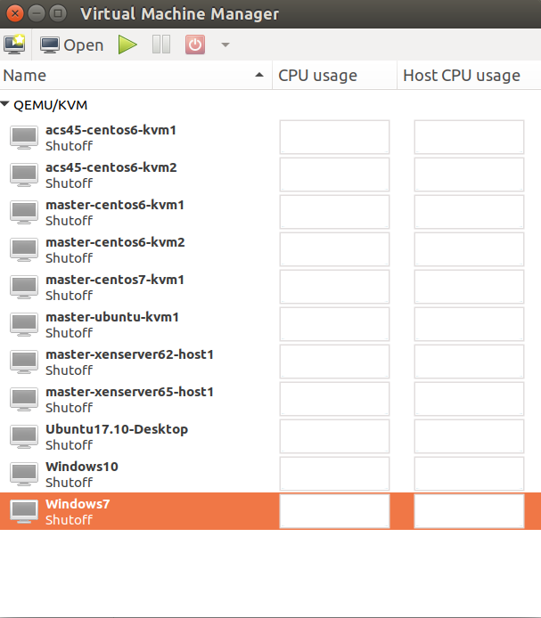
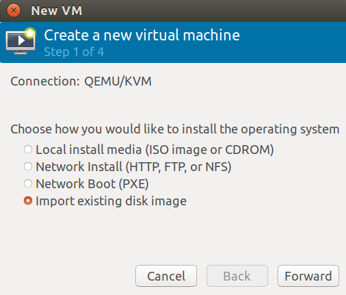
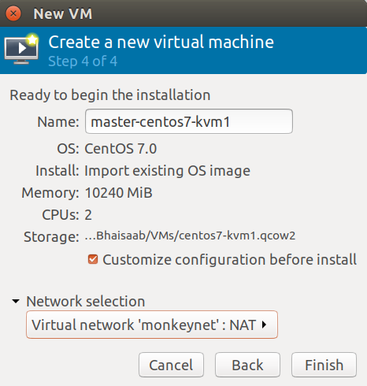
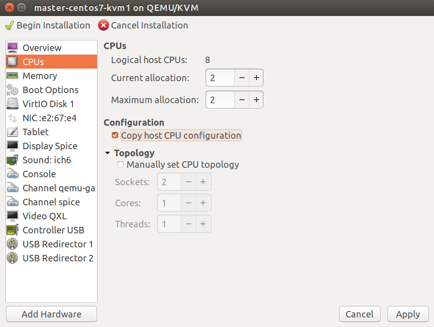

This is deprecated now, see https://github.com/rhtyd/mbx

# MonkeyBox by @rhtyd

The goal of this project is to help new CloudStack developers setup development
environment based on ready to use VM boxes.

Notes:
- This guide assumes that you're running a latest debian-based GNU/Linux
  distro such as Ubuntu. This guide was tested with `Ubuntu 17.10`.
- Your laptop/platform has at least 16GB RAM and x86_64 Intel-VT or AMD-V
  enabled CPU so you can run hardware-accelerated nested hypervisors.
- If you've any other hypervisor such as VirtualBox or VMware workstations
  please uninstall it before proceeding further.
- Due to license issues, pre-built KVM-based monkeyboxes are only published.
  Watch this space in sometimes, I may blog about how to DIY XenServer and
  VMware/ESXi+vCenter monkeybox.

Pre-built :monkey:boxes can be [downloaded](http://dl.rohityadav.cloud/monkeyboxes/) from:

    http://dl.rohityadav.cloud/monkeyboxes/

Clone the monkeybox repo using:

    $ git clone https://github.com/rhtyd/monkeybox.git

Build an appliance using:

    $ cd <path> && packer build <json fil>

Vagrant boxes are coming soon!

# TODO

- Ready to use KVM Boxes: Ubuntu
- How to DIY XenServer and VMware monkeybox

## Defaults

Default password for the `root` user is `password`.

These are the default static IPs of the MonkeyBox appliances:

    KVM: 172.20.1.10
    XenServer: 172.20.1.20
    VMware: 172.20.1.30 (vCenter on 172.20.1.31, password: P@ssword123)

IP range 172.20.1.50-254 is used by DHCP server for dynamic IP allocation.

## Install KVM on your Laptop

Install KVM using following:

    # apt-get install qemu-kvm libvirt-bin bridge-utils cpu-checker
    # kvm-ok

Install `virt-manager`, the virtual machine manager graphical tool to manage VMs
on your machine:

    # apt-get install virt-manager

Note: you need to install/setup KVM only once.

## MonkeyNet Virtual Networking

For our local dev-test environment, we'll create a 172.20.0.0/16 virtual network
with NAT so VMs on this network are only accessible from the host/laptop but
not by the outside network.

    External Network
      .                     +-----------------+
      |              virbr1 | MonkeyBox VM1   |
      |                  +--| IP: 172.20.1.10 |
    +-----------------+  |  +-----------------+
    | Host x.x.x.x    |--+
    | IP: 172.20.0.1  |  |  +-----------------+
    +-----------------+  +--| MonkeyBox VM2   |
                            | IP: 172.20.x.y  |
                            +-----------------+

We're choosing here 172.20.0.0/16 as the network range because as per RFC1918
it is allowed to be used for private networks. The 192.168.x.x and 10.x.x.x
may be already used by VPN, lab resources and home networks which is why we
need to choose this range.

To keep the setup simple all MonkeyBox VMs have a single nic which can be
used as a single physical network in CloudStack that has the public, private,
management/control and storage networks. A complex setup is possible by adding
multiple virtual networks and nics on them.

### Setup MonkeyNet Virtual Network

Run the following to setup `monkeynet` virtual network as described in above
section:

    $ virsh net-define monkeynet.xml
    $ virsh net-autostart monkeynet
    $ virsh net-start monkeynet

The default network xml definition assumes `virbr1` is not already assigned, in
case you get an error change the bridge name to something other than `virbr1`.

Finally confirm using:

    $ virsh net-list
    Name                 State      Autostart     Persistent
    ----------------------------------------------------------
    default              active     yes           yes
    monkeynet            active     yes           yes

    $ ifconfig virbr1
    virbr1: flags=4099<UP,BROADCAST,MULTICAST>  mtu 1500
        inet 172.20.0.1  netmask 255.255.0.0  broadcast 172.20.255.255
        ether 52:54:00:c4:5b:40  txqueuelen 1000  (Ethernet)
        RX packets 0  bytes 0 (0.0 B)
        RX errors 0  dropped 0  overruns 0  frame 0
        TX packets 0  bytes 0 (0.0 B)
        TX errors 0  dropped 0 overruns 0  carrier 0  collisions 0

Alternatively, you may open `virt-viewer` manager and click on:

    Edit -> Connection Details -> Virtual Networks

Add a virtual network with NAT in 172.20.0.0/16 like below:

This will create a virtual network with NAT with the CIDR 172.20.0.0/16, your
gateway will be `172.20.0.1` which is also your host's virtual bridge IP. The
virtual network's bridge name `virbrX`may be different and it does not matter as long
as you've a NAT-enabled virtual network in 172.20.0.0/16.

Note: you need to setup virtual networking only once.

## Using MonkeyBox Appliance

Build or download [pre-built](http://dl.rohityadav.cloud/monkeyboxes/) monkey box appliance and import them as VMs using
virt-viewer by adding a new VM:

Next, select the qcow2 disk image and configure the import for example 8GBs of
RAM and 2 CPU cores, and make sure to select the private virtual network
created before (`monkeynet`):

Before starting the imported appliance, select the option to copy host CPU
configuration which will choose a CPU configuration similar to your host's CPU, i.e.
will allow nested hypervisors:

### Networking and Dev/Test Setup

Your base platform (laptop) will have the gateway IP `172.20.0.1`.

Ideally, run your favourite IDE such as IntelliJ IDEA, text-editors, your
management server, MySQL server and NFS server (secondary and primary storages)
on your laptop (not in a VM) where these services can be accessible to VMs, KVM
hosts etc. at your host IP `172.20.0.1`.

Once your VM has started, try remote login using: (root:password, replace IP
with the IP of your monkeybox host)

    $ ssh root@172.20.1.10

If you need multiple hypervisor hosts, you can either clone an existing
monkeybox VM or re-import a new monkeybox template image (qcow2 etc). In such
cases, do change the new VM's (bridge) IPs, rename their hostname and restart
them before you use them as additional hypervisor hosts.

## CloudStack Development

### Install Development Tools

Run this:

    $ sudo apt-get install openjdk-8-jdk maven python-mysql.connector libmysql-java mysql-server mysql-client bzip2 nfs-common uuid-runtime python-setuptools ipmitool genisoimage nfs-kernel-server quota

Setup IntelliJ (recommended) or any IDE of your choice. Get IntelliJ IDEA
community edition from:

    https://www.jetbrains.com/idea/download/#section=linux

Install pyenv, jenv as well.

Setup `aliasrc` that defines some useful bash aliases, exports and utilities
such as `agentscp`. Run the following while in the directory root:

    $ echo "source $PWD/aliasrc" >> ~/.bashrc
    $ echo "source $PWD/aliasrc" >> ~/.zshrc

You may need to `source` your shell's rc/profile or relaunch shell/terminal
to use `agentscp`.

### Setup MySQL Server

After installing MySQL server, configure the following settings in its config
file such as at `/etc/mysql/mysql.conf.d/mysqld.cnf` and restart mysql-server:

    [mysqld]

    sql-mode="STRICT_TRANS_TABLES,NO_ENGINE_SUBSTITUTION,ERROR_FOR_DIVISION_BY_ZERO,NO_ZERO_DATE,NO_ZERO_IN_DATE,NO_ENGINE_SUBSTITUTION"
    server_id = 1
    innodb_rollback_on_timeout=1
    innodb_lock_wait_timeout=600
    max_connections=1000
    log-bin=mysql-bin
    binlog-format = 'ROW'

### Setup NFS storage

After installing nfs server, configure the exports:

    echo "/export  *(rw,async,no_root_squash,no_subtree_check)" > /etc/exports
    mkdir -p /export/testing/primary /export/testing/secondary

Beware: Before deploying a zone on your monkeybox environment, make sure to seed
the correct systemvmtemplate applicable for your branch. In your cloned
CloudStack git repository you can use the `cloud-install-sys-tmplt` to seed
the systemvmtemplate.

The following is an example to setup `4.11.3` systemvmtemplate which you should
run after deploying CloudStack db: (please use CloudStack branch/version specific
systemvmtemplate)

    cd /path/to/cloudstack/git/repo
    wget http://packages.shapeblue.com/systemvmtemplate/4.11/systemvmtemplate-4.11.3-kvm.qcow2.bz2
    ./scripts/storage/secondary/cloud-install-sys-tmplt \
          -m /export/testing/secondary -f systemvmtemplate-4.11.3-kvm.qcow2.bz2 \
          -h kvm -o localhost -r cloud -d cloud

### Build and Test CloudStack

It's assumed that the directory structure is something like:

        folder
        ├── cloudstack
        └── monkeybox

Fork the repository at: github.com/apache/cloudstack, or get the code:

    $ git clone https://github.com/apache/cloudstack.git

Noredist CloudStack builds requires additional jars that may be installed from:

    https://github.com/rhtyd/cloudstack-nonoss

Clone the above repository and run the install.sh script, you'll need to do
this only once or whenver the noredist jar dependencies are updated in above
repository.

Build using:

    $ mvn clean install -Dnoredist -P developer,systemvm

Deploy database using:

    $ mvn -q -Pdeveloper -pl developer -Ddeploydb

Run management server using:

    $ mvn -pl :cloud-client-ui jetty:run  -Dnoredist -Djava.net.preferIPv4Stack=true

Install marvin:

    $ sudo pip install --upgrade tools/marvin/dist/Marvin*.tar.gz

While in CloudStack's repo's root/top directory, run the folllowing to copy
agent scripts, jars, configs to your KVM host:

    $ cd /path/to/git-repo/root
    $ agentscp 172.20.1.10  # Use the appropriate box IP

Deploy datacenter using:

    $ python tools/marvin/marvin/deployDataCenter.py -i ../monkeybox/adv-kvm.cfg

Example, to run a marvin test:

    $ nosetests --with-xunit --xunit-file=results.xml --with-marvin --marvin-config=../monkeybox/adv-kvm.cfg -s -a tags=advanced --zone=KVM-advzone1 --hypervisor=KVM test/integration/smoke/test_vm_life_cycle.py

Note: Use nosetests-2.7 to run a smoketest, if you've nose installed for both Python2.7 and Python3.x in your environment.

When you fix an issue, rebuild cloudstack and push new changes to your KVM host
using `agentscp` which will also restart the agent:

    $ agentscp 172.20.1.10

Using IDEA IDE:
- Import the `cloudstack` directory and select `Maven` as build system
- Go through the defaults, in the profiles page at least select noredist, vmware
  etc.
- Once IDEA builds the codebase cache you're good to go!

### Debugging CloudStack

Prior to starting CloudStack management server using mvn (or otherwise), export
this on your shell:

    export MAVEN_OPTS="$MAVEN_OPTS -Xdebug -Xrunjdwp:transport=dt_socket,address=8787,server=y,suspend=n"

To remote-debug the KVM agent, put the following in
`/etc/default/cloudstack-agent` in your monkeybox and restart cloudstack-agent:

    JAVA=/usr/bin/java -Xdebug -Xrunjdwp:transport=dt_socket,address=8787,server=y,suspend=n

The above will ensure that JVM with start with debugging enabled on port 8787.
In IntelliJ, or your IDE/editor you can attach a remote debugger to this
address:port and put breakpoints (and watches) as applicable.

## Author

[Rohit Yadav](http://rohityadav.cloud), rohit@yadav.cloud

## Contributing

Send a pull request on https://github.com/rhtyd/monkeybox

## Troubleshooting

### Iptables

Should your datacenter deployment fail due to the KVM host unable to reach your management server, it might be due to iptable rules.

If you see this in your hosts agent.log:

    java.net.NoRouteToHostException: No route to host
            at sun.nio.ch.Net.connect0(Native Method)
            at sun.nio.ch.Net.connect(Net.java:454)
            at sun.nio.ch.Net.connect(Net.java:446)
            at sun.nio.ch.SocketChannelImpl.connect(SocketChannelImpl.java:648)
            at com.cloud.utils.nio.NioClient.init(NioClient.java:56)
            at com.cloud.utils.nio.NioConnection.start(NioConnection.java:95)
            at com.cloud.agent.Agent.start(Agent.java:263)
            at com.cloud.agent.AgentShell.launchAgent(AgentShell.java:410)
            at com.cloud.agent.AgentShell.launchAgentFromClassInfo(AgentShell.java:378)
            at com.cloud.agent.AgentShell.launchAgent(AgentShell.java:362)
            at com.cloud.agent.AgentShell.start(AgentShell.java:467)
            at com.cloud.agent.AgentShell.main(AgentShell.java:502)

And a telnet from host to management server on port gives this result:

    $ telnet 172.20.0.1 8250
    Trying 172.20.0.1...
    telnet: connect to address 172.20.0.1: No route to host
    
Clearing your iptables and setting new rules should take care of the issue. (Tested on Ubuntu 17.10)

Run the following commands as su or with sudo powers.

First, flush your rules and delete any user-defined chains:
    
    $ iptables -t nat -F && iptables -t nat -X
    $ iptables -t filter -F && iptables -t filter -X
    
Add new rules by running the two scripts located in docs/scripts to set up new nat and filter rules, 
ensuring that the network name (virbr1) in filter.table matches your management server IP:

    $ bash -x <script>
    
Alternatively, add each rule separately.
 
Finally, save your iptables.
 
Ubuntu:
 
    iptables-save
    
and if using iptables-persistent:

    service iptables-persistent save
    
CentOS 6 and older (CentOS 7 uses FirewallD by default):

    service iptables save
