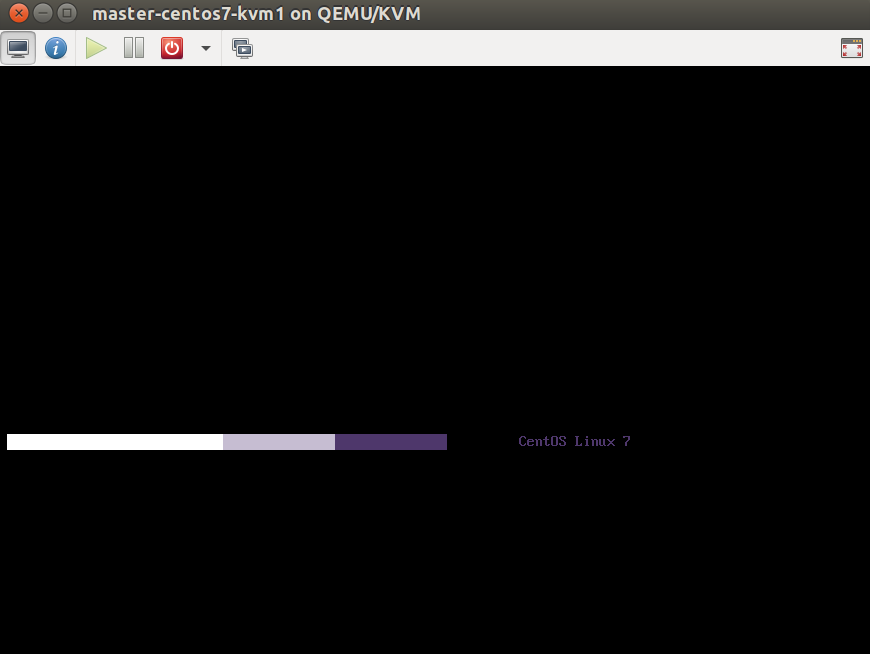

# MonkeyBox by @rhtyd



The goal of this project is to help new CloudStack developers setup development
environment based on ready to use VM boxes.

`Note`: This guide assumes that you're running a latest debian-based GNU/Linux
distro such as Ubuntu and your laptop/platform has at least 16GB RAM and a
Intel-VT or AMD-V enabled CPU so you can run on KVM hardware-accelerated nested
hypervisors. If you've any other hypervisor such as VirtualBox or VMware
workstations please uninstall it before proceeding further.

## Default IPs

These are the default static IPs of the appliances:

MonkeyBox CentOS7 KVM: 172.20.1.10
MonkeyBox XenServer 6.5: 172.20.1.15

Default password for the `root` user is `password`.

## Install KVM on your Laptop

Install KVM using following:

    # apt-get install qemu-kvm libvirt-bin bridge-utils cpu-checker
    # kvm-ok

Install `virt-manager`, the virtual machine manager graphical tool to manage VMs
on your machine:

    # apt-get install virt-manager


### Setup KVM Virtual Networking

Click on Edit -> Connection Details -> Virtual Networks and add a virtual
network as shown in the screenshot below:


This will create a virtual network with NAT with the CIDR 172.20.0.0/16, your
gateway will be `172.20.0.1` which is also your host's virtual bridge IP.

We're choosing here 172.20.0.0/16 as the network range because as per RFC1918
it is allowed to be used for private networks. The 192.168.x.x and 10.x.x.x
may be already used by VPN, lab resources and home networks which is why we
need to choose this range. On this range, CloudStack's
private/public/storage/control networks may be allocated.

## Using MonkeyBox Appliance

Build or download pre-built monkey box appliance and import them as VMs using
virt-viewer by adding a new VM:


Next, select the qcow2 disk image and configure the import for example 8GBs of
RAM and 2 CPU cores, and make sure to select the private virtual network
created before (`monkeynet`):


Before starting the imported appliance, select the option to copy host CPU
configuration which will choose a CPU configuration similar to your host's CPU, i.e.
will allow nested hypervisors:


### Networking

Your base platform (laptop) will have the gateway IP `172.20.0.1`.

Run your favourite IDE/text-editors, your management server, MySQL server, NFS
server (secondary and primary storages) on your host where these services will
be accessible to VMs, KVM hosts etc. at 172.20.0.1.

Once your VM has started, try remote login using: (root:password)

    ssh root@172.20.1.10

## CloudStack Development

Build using:

    mvn clean install -Dnoredist -P developer,systemvm

Deploy database using:

    mvn -q -Pdeveloper -pl developer -Ddeploydb

Run management server using:

    mvn -pl :cloud-client-ui jetty:run  -Dnoredist -Djava.net.preferIPv4Stack=true

Copy agent scripts and code using: (see more on agentscp in next section)

    cd /path/to/git-repo/root
    agentscp 172.20.1.10

Deploy datacenter using:

    python tools/marvin/marvin/deployDataCenter.py -i ../monkeybox/adv-kvm.cfg

### Copying agent scripts and code

Put the following in your `~/.bashrc` or `~/.zshrc`:

```
agentscp() {
  ROOT=$PWD
  echo "[acs agent] Syncing changes to agent: $1"

  echo "[acs agent] Copied systemvm.iso"
  scp $ROOT/systemvm/dist/systemvm.iso  root@$1:/usr/share/cloudstack-common/vms/

  echo "[acs agent] Syncing python lib changes to agent: $1"
  scp -r $ROOT/python/lib/* root@$1:/usr/lib64/python2.6/site-packages/ 2>/dev/null || true
  scp -r $ROOT/python/lib/* root@$1:/usr/lib64/python2.7/site-packages/ 2>/dev/null || true

  echo "[acs agent] Syncing scripts"
  scp -r $ROOT/scripts/* root@$1:/usr/share/cloudstack-common/scripts/

  echo "[acs agent] Syncing kvm hypervisor jars"
  ssh root@$1 "rm -f /usr/share/cloudstack-agent/lib/*"
  scp -r $ROOT/plugins/hypervisors/kvm/target/*jar root@$1:/usr/share/cloudstack-agent/lib/
  scp -r $ROOT/plugins/hypervisors/kvm/target/dependencies/*jar root@$1:/usr/share/cloudstack-agent/lib/

  echo "[acs agent] Syncing cloudstack-agent config and scripts"
  scp $ROOT/agent/target/transformed/log4j-cloud.xml root@$1:/etc/cloudstack/agent/
  ssh root@$1 "sed -i 's/INFO/DEBUG/g' /etc/cloudstack/agent/log4j-cloud.xml"
  ssh root@$1 "sed -i 's/logs\/agent.log/\/var\/log\/cloudstack\/agent\/agent.log/g' /etc/cloudstack/agent/log4j-cloud.xml"
  scp $ROOT/agent/target/transformed/libvirtqemuhook root@$1:/usr/share/cloudstack-agent/lib/

  scp $ROOT/agent/target/transformed/cloud-setup-agent root@$1:/usr/bin/cloudstack-setup-agent
  ssh root@$1 "sed -i 's/@AGENTSYSCONFDIR@/\/etc\/cloudstack\/agent/g' /usr/bin/cloudstack-setup-agent"
  scp $ROOT/agent/target/transformed/cloud-ssh root@$1:/usr/bin/cloudstack-ssh
  scp $ROOT/agent/target/transformed/cloudstack-agent-upgrade root@$1:/usr/bin/cloudstack-agent-upgrade
  ssh root@$1 "chmod +x /usr/bin/cloudstack*"

  echo "[acs agent] Copied all files, start hacking!"
}
```

Build CloudStack code, cd to the git repository's root directory and run the
following to transfer new jars, files, configs etc:

    agentscp YOUR-MONKEYBOX-IP


If needed, manually restart the agent using:

    systemctl restart cloudstack-agent


